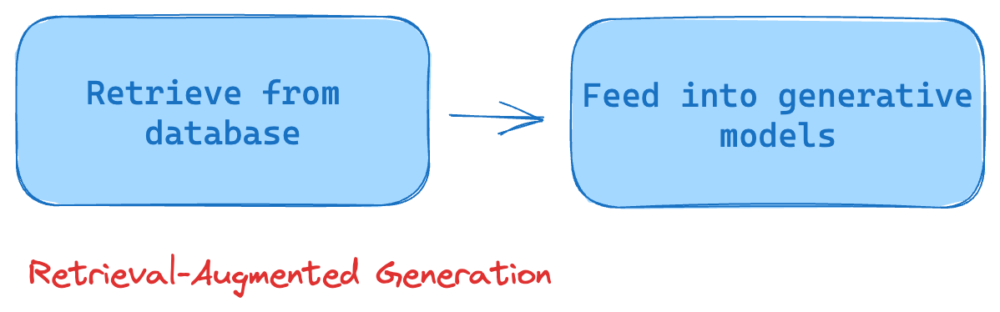

# Why do we care?

RAG powers a number of important applications in society. These include: 

- Being able to find important information within PDFs
- Providing grounded generation of text to avoid hallucinations 
- Providing references for when generations happen

It consists of 2 main components:

1. Retrieval (usually from a database like a vector database)
2. Generation (usually in the form of a large language model)

## The rise of vector databases

The rise of vector databases has been significantly influenced by the surge in AI and machine learning applications, with tools like ChatGPT leveraging high-dimensional vector representations for storing and processing information. The ability of these databases to handle complex queries with agility and precision that traditional databases struggle with has further fueled their popularity. Additionally, the growth of big data, the need for real-time processing, and their capability to vastly improve the efficiency of similarity search operations in large datasets underscore the increasing adoption of vector databases.

## LLMS + Vector Databases = RAG

Large Language Models (LLMs) like ChatGPT and vector databases combine to form the Retrieval-Augmented Generation (RAG) system, enhancing its performance and importance. In essence, the LLM assists in creating a rich encoding of information, while the vector database aids in efficiently storing and retrieving these high-dimensional vectors. The retrieval process helps in pinpointing relevant information needed during generation, which wouldn't be possible with a simple LLM. This combination allows RAG to contextualize vast databases of information over a wide array of topics, thus generating more informed, detailed, and nuanced responses.
